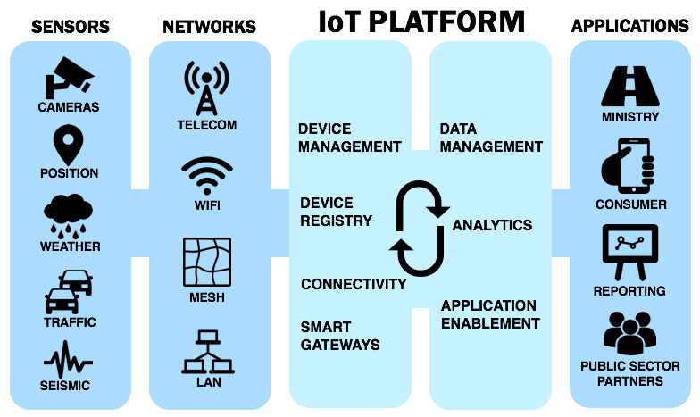

#MOTI's IoT Initiative

Sensing the Future: The Need for an Advanced Camera and Sensor Information System (ACSIS)

_“The ministry has camera and sensor data that is tremendously valuable to the public and industry. The new ACSIS platform will pool our data from different program areas around the ministry, and make it easy to manage and share with industry partners. It paves the way for smart highways and smart cities.”_

~ Business Sponsor Ed Miska, Executive Director Engineering Services

##BC On The Move

In 2015, MOTI announced [BC on the Move](https://news.gov.bc.ca/stories/bc-launches-10-year-transportation-plan), a 10-year, $2.5-billion transportation plan that outlines critical investments and improvements throughout the province that will grow the economy, improve safety, maintain and replace aging infrastructure, support trade for BC’s expanding resource sector through Canada’s Asia-Pacific Gateway and improve the daily lives of British Columbians.

The ACSIS project reflects MOTI’s commitment to BC on the Move by enhancing Driver Information Systems, increasing efficiency and efficacy of transportation business decision-making, providing greater access to reliable images and video of BC’s transportation corridors to allow citizens to make informed decisions about travel, safer winter driving, and road-events and closures, and optimized economic activity from BC Highways due to more efficient transportation routes for citizens and visitors.

Additionally, ACSIS aligns to the Ministry’s Service Plan 2015/16 to 18/19; this enterprise-level investment will help the ACSIS program evolve from a “capped” application to an enterprise-level platform that will support camera and sensor data from a variety of Ministry programs. It represents a major enhancement of the HighwayCams program that will help meet the future redesign goals of DriveBC. This investment aligns with the Ministry Service Plan in its goal to:

* Improve and maximize Highway Safety and Reliability
* Enhancing the DriveBC website backend so it provides a better user experience on the front end.

##Our MOTIvation

For many years, MOTI has operated thousands of remote devices—highway cameras, road and construction site cameras, weather stations, earthquake sensors, avalanche sensors and more. We have extensive experience with sensors, sensor data, and the use and publication of that data.

With our drive for continuous improvement, the ministry is facing massive changes in the digital world and the ensuing impacts on transportation as we know it.

Our successful BC Highway Camera System, for example, is reaching full capacity, facing increasing demand for more cameras and information. Public consumption continues to increase year over year, placing demand pressures on the current platform. Supporting the requirement for modernization, new technology advances are the right way to move forward to a future-ready solution to serve BC citizens and industry.

It is time to move forward, and key to our transformation is to significantly improve interoperability of our systems; implement resilient, adaptable systems that are ready for the future; establish a trusted source of data; drive technical innovation; and, employ dynamic, responsive application delivery by developing a new partnership model with the tech industry which enhances the development and delivery of solutions for the government—to co-create value from open government data.

For example, we envision significant citizen benefits from mobile access to camera and sensor information across the province. To provide informed choices for more efficient travel on BC highways and contribute to enhanced public safety, optimized economic activity in BC, and increased citizen trust and confidence in government.

##IoT Superstructure Approach

We have made the strategic decision to implement an open Internet of Things (IoT) solution; an IoT data collection and management system that is responsive to business needs and technology advancement. A core component of the backend system is an open IoT platform built using open standards and component-based architecture, enabling multiple solution providers to deliver data-centric solutions that increase productivity, expand services to the public, and enable smart transportation solutions.

We want to establish an IoT superstructure supporting multiple-business domains, served by multiple-vendors pushing data into an open IoT platform where our applications can operate on that data to perform cleanup,

consolidation, processing, analysis, publication and more. A new IoT system will establish a “single source of truth” for all camera and sensor data, enhancing services and increasing efficiency in the way we operate.

An IoT system connects data-collecting devices to a network and enables the collection, analysis and exchange of generated information. Think of a household thermostat, which senses temperature changes and activates the furnace based on that information.

We could use camera and sensor information together for identification, notification, alerts, response, and management of natural disasters such as earthquakes, flooding, landslides and avalanches. For example, this platform could correlate the BC Highway Camera system with other Ministry camera and sensor systems—such as those that scan for and report on weather events and natural disasters—and respond appropriately.

Industry is trending toward IoT platforms managing transportation infrastructure and Intelligent Transportation Systems (ITS).

Our goal is that this scalable, open, reliable, future-ready platform will improve system availability and reduce service outages; create consistent and reliable system integration; enhance reliability and scalability of service; enable coordination and integration of Ministry applications that collect, manage and disseminate camera and sensory data; and, improve operational performance and maintenance and upgrade costs.

Ultimately, this will increase platform stability as use increases; meet growing demands for transportation information; provide the capability for data analytics and information sharing; provide richer features, higher quality images and data; greater dependability; and, increase citizen benefit from open data and taxpayer investment in camera and sensor systems.

###Creating the IoT Architecture Vision

The extensive IoT space provides flexibility, scalability, expandability, security, monitoring, data persistence, data consolidation, analytics, knowledge creation, device management, cost-savings, edge/fog computing and more. 
MOTI is taking a two-step-process approach for selecting and building an IoT architectural vision. We started by building a Proof-of-Concept (POC) prototype open-source platform based upon the Eclipse family of IoT Projects (iot.eclipse.org). Our second step is to take what we have learned from building a prototype, from the coming BC Tech IoT Challenges, and from industry, to define and begin creating a platform based on a solid MOTI IoT vision. 
We are conducting our trial to assess the viability of using open source IoT software. The final IoT platform may be a component-based superstructure provided by a traditional vendor or open source community—we are still evaluating. While the final vision will likely be very different from our prototype platform, we are delighted with prototype path we have taken in getting hands-on with the technology, and collaborating and learning from BC’s industry leaders in the IoT space. 

####IoT Platform Functional Architecture

IoT covers a huge range of technologies that interconnect systems – cloud to fog. Our target architecture supports innovations in sensor networks and applications with a secure, scalable, modular IoT backend that allows IoT features to be source from multiple vendors, based on widely-adopted (mature) open standards and well-defined APIs.

Our proof-of-concept platform showcases opportunities for IoT innovation, shaping our thinking on modernizing MOTI’s IoT system as we seek opportunities to leverage our extensive MOTI cameras, sensors and data through our prototype IoT platform that will:

* Enable smart transportation solutions using MOTI real-time data
* Enable ways to disseminate MOTI weather data through open standards
* With sets of next generation applications to manage smart sensors
* Connect MOTI data with the coming wave of autonomous vehicle data

##ACSIS Project

To meet Ministry and government strategic goals, MOTI’s Information Management Branch (IMB) is managing the Advanced Camera and Sensor Information System (ACSIS) project in collaboration with the Highways Department and Business Management Services Branch (BMSB).

The overall goal of the ACSIS project is to implement a centrally-managed platform that will form the foundation upon which the government’s transportation-related camera and sensor systems will be deployed and managed. The new platform will breakdown data and operational silos that exist within the Ministry of Transportation and Infrastructure, and implement an open data framework that will provide a “single source of truth” for camera and sensor data that is accessible by the Ministry and the public, and is more cost effective in the long run.

The ACSIS project shall:

* Pool data to make collaboration between business areas easier
* Allow better monitoring of sensors
* Align with Intelligent Transportation System (ITS) goals to enhance public safety
* Enhance support for emergency response and early warning systems
* Foster partnerships with tech industry
* Allow us to adapt to future technological advances
* Increase trust and confidence in government

The ACSIS product will be implemented as an Internet of Things (IoT) Platform, with a focus on the creation of server middleware consisting of a common set of data collection, management and distribution services for all Ministry camera and sensor applications. While the primary goal is to solve immediate business and operational needs associated with Ministry camera and sensor systems, the ACSIS IoT Platform will host an easily-consumable repository of sensor data that can enable innovation and rapid development of new sensor applications within the government and private sectors.

Our goal is:

* To implement a new, enterprise-wide IoT platform consisting of a common set of collection, management and distribution services for Ministry camera and sensor applications. 
* To provide a “single source of truth” for camera and sensor data that is accessible by the Ministry, industry, and the public while leveraging Open511 data specifications and protocols to ensure maximum alignment with the BC Government’s open-data initiatives.
* Become a foundation upon which the government’s transportation-related camera and sensor applications will operate, including the replacement of the existing HighwayCams system with a consolidated camera administration console. 
* Enhance Ministry business practices to improve efficiency and open the door to innovative approaches for processing and analysis of sensor data.
* Provide scalable and trusted data services for British Columbians to make informed choices for safer and more efficient travel on B.C highways. 

ACSIS product will be based on a hybrid development methodology, managed using a combination of System Development Lifecycle (SDLC) and Agile software development approaches.

We are using innovative methods to develop the system, including agile process management and open source development. In March 2017, we are participating in the BC Tech Summit Challenge, with the goal of showing how the BC government can work with the tech industry to develop new technologies through open source development. What we learn from the event will inform the development of the IoT system, which we estimate will take three years.

Early adopters of the ACSIS platform include:

* Ministry camera systems
* Avalanche Weather Program (AWP) cameras and sensors
* BC Seismic Information System (BCSIMS) sensors
