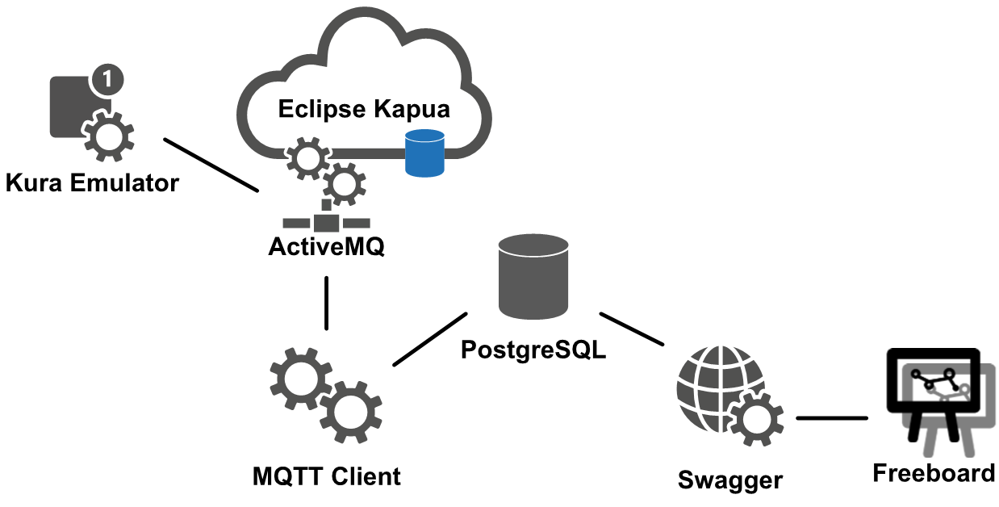

# MOTI / BCIC IoT Challenges

On March 13, 2017 the BC Innovation Council (BCIC) hosted the Ministry of Transportation and Infrastructure (MOTI) and the BC Tech community at an [IoT Discovery Day](http://bcic.ca/events/iot-discovery-day/). At that event, BCIC presented a series of challenges to the BC Tech Community to collaborate with MOTI in creating multi-party, multi-platform and multi-device government IoT capabilities.

This repository provides parties interested in participating in BCIC's IoT Challenges with information on MOTI, BCIC, the MOTI IoT Proof-of-Concept (PoC) platform and a map to background information about the challenge.

Start here to learn about the business and technical components of the IoT Challenges.

##Who is MOTI?

The [BC Ministry of Transportation and Infrastructure](http://www.th.gov.bc.ca/) (MOTI) plans transportation networks, provides transportation services and infrastructure, develops and implements transportation policies, and administers many related acts and regulations, as well as, federal-provincial funding programs, including the Building Canada Fund.

##Who is BCIC?

[BC Innovation Council](http://bcic.ca/) (BCIC) encourages the development and application of advanced or innovative technologies to meet the needs of industry in BC. We accelerate technology commercialization by supporting startups and developing entrepreneurs.

##IoT Challenge

To enhance our ability to deliver a modern IoT capability, MOTI is participating in the BC Tech Summit Challenge. Based on our experiences in creating the IoT Prototype, we developed a list of key challenges that we are putting out to the BC Tech sector, with the added goal of demonstrating how the BC government can work with the tech industry to develop new technologies through open source development.

MOTI, in partnership with the BC Innovation Council (BCIC), will fund up to five projects aimed at tackling our IoT Challenges. BC Tech organizations will be selected to go further with their ideas, with seed funding of $10,000 (each) to drive innovation. A sixth (unfunded) challenge, is an opportunity for BC’s IoT leaders to provide guidance on our strategic direction.

##The MOTI IoT Proof-of-Concept (PoC)

The MOTI IoT PoC is a technical spike for getting started creating a modern IoT capability at MOTI. The idea is for MOTI to build the PoC by:

* identifying Open Source IoT capabilities ([Eclipse IoT](https://iot.eclipse.org/) was selected, with [Eclipse Kapua](https://projects.eclipse.org/projects/iot.kapua) serving as the core platform element),
* standing up the selected Open Source IoT capabilities on an internally-hosted (at a Government Data Centre) PaaS Platform - [Red Hat's OpenShift Container Platform](https://www.openshift.com/container-platform/),
* connecting simulated and real IoT devices to the platform (using the [Eclipse Kura Smart Gateway](http://www.eclipse.org/kura/) and [Kura emulator](https://wiki.eclipse.org/Kura/Getting_Started#Emulator)),
* extracting and presenting data collected from the real and emulated IoT Devices.

The result is very deliberately named a "Proof-of-Concept" - it is an [Agile Technology Spike](https://goo.gl/cghvMp) intended to be used for team learning and not ongoing working software. The PoC is opportunity for the MOTI team to work with modern (and even bleeding edge) IoT tools, learn, document findings and to get something working - without committing to a long-term solution. 

The outcome of the PoC spike was demonstrated at the [BCIC IoT Industry Day](http://bcic.ca/events/iot-discovery-day/) when BCIC's IoT Challenges were announced.

##Map of the MOTI IoT Challenge Information

The following is the layout of the information MOTI has assembled as part of this PoC about IoT and the challenges we have put together around IoT for interested collaborators. 

* Overview - this document - an overview of the technical information needed by prospective Challenge participants
* [MOTI's IoT Initiative](./MOTI-IoT-Initiative.md)
* MOTI IoT PoC Platform: The [Eclipse Kapua Project](https://projects.eclipse.org/projects/iot.kapua)
* MOTI IoT PoC Gateway: The [Eclipse Kura Project](http://www.eclipse.org/kura/)
* MOTI IoT [Challenge 1: Smart Gateway](./MOTI-IoT-Challenge-1-Smart-Gateway.md)
* MOTI IoT Challenge 2: Event Stream Processing
* MOTI IoT Challenge 3: Analytics
* MOTI IoT Challenge 4: BC Highway Cameras
* MOTI IoT Challenge 5: Open Innovation
* Your Ideas: IoT Strategic Direction
* The MOTI IoT Demo - a repository of work done with Eclipse Kapua, Karu and other Open Source tools for a demo presented at the BC Tech Summit 2017.

#The PoC Architecture

The image below shows the architecture of the MOTI IoT PoC environment.

##IoT Platform

The central component of the architecture is the instance of [Eclipse Kapua](https://projects.eclipse.org/projects/iot.kapua) running on the BC Government OpenShift Container Platform.  Kapua includes:

* a device (sensor) repository, handling the full device lifecycle - from self-registration through termination,
* an [MQTT](http://mqtt.org/) Broker receiving and managing device data, 
* an API to access Kapua held information, and
* a Console for accessing/managing the device repository.

##IoT Sensor Emulation and Gateway

An implementation of an [Eclipse Kura](http://www.eclipse.org/kura/) MQTT client emulator feeds data into Kapua. The PoC sources data from several sources - primarily a source of DriveBC images and sensor data from a Weather Station Data Logger.  The Weather Station Data Logger is an example of a sensor aggregator - periodically delivering data such as temperature, precipitation, frost depth, barometric pressure and other weather related metrics from a single location. In the future implementation, we anticipate that weather logger data will connect to the centralized platform via a Smart Gateway Device - a device capable of delivering data using an industry-standard protocol (such as MQTT) and capable of being remotely managed from the central platform for monitoring, restarts, firmware upgrades and so on.

##IoT Application Data Collection

For output - processing data delivered to the central platform - the PoC implements a [.NET Core](https://dotnet.github.io/) instance of an MQTT client that registers itself with Kapua as a data subscriber. The Client subscribes to a set of devices, and data received by Kapua from those devices are automatically published to the client. The client is simple, taking data received from Kapua and inserting the values into tables in a Postgres Database.  This emulates a domain specific backend configured to monitor a set of sensors and collect the data for subsequent processing. The client service could be expanded to support a number of cross-cutting purposes - data exception detection/notifications, data quality assessment/filtering and so on.

There is a range of possible data stores that might be appropriate based on the characteristics of the data from different sensor types. Relational (like [Postgres](https://www.postgresql.org/)), NoSQL (like [Mongo](https://github.com/mongodb/mongo)) and Time Series (like [InfluxDB](https://github.com/influxdata/influxdb)) Data Stores are all candidates for different data type use cases. Regardless of the data storage mechanism, the data store(s), in conjunction with an associated API, is required to merge into the MOTI Enterprise Data Architecture to ensure that there is but a single source of truth for data elements across the Enterprise.

To make the collected, domain-specific data for the PoC available for presentment, a .NET Core service was implemented to provides an API to return data recently pushed into the Postgres database. The exposed API (built using [Swagger](http://swagger.io/)) is an example of an API that might be protected and used internally within MOTI or made available publicly to enable private sector uses.

##IoT Application Visualization

To complete the PoC - enabling direct access to select sensor data for staff and citizens - the Application API was used by an instance of the [Freeboard IoT Dashboard](https://freeboard.io/) to make the data available for the intended data consumers. Various widgets and data configurations are used to present different types of data in useful forms.
